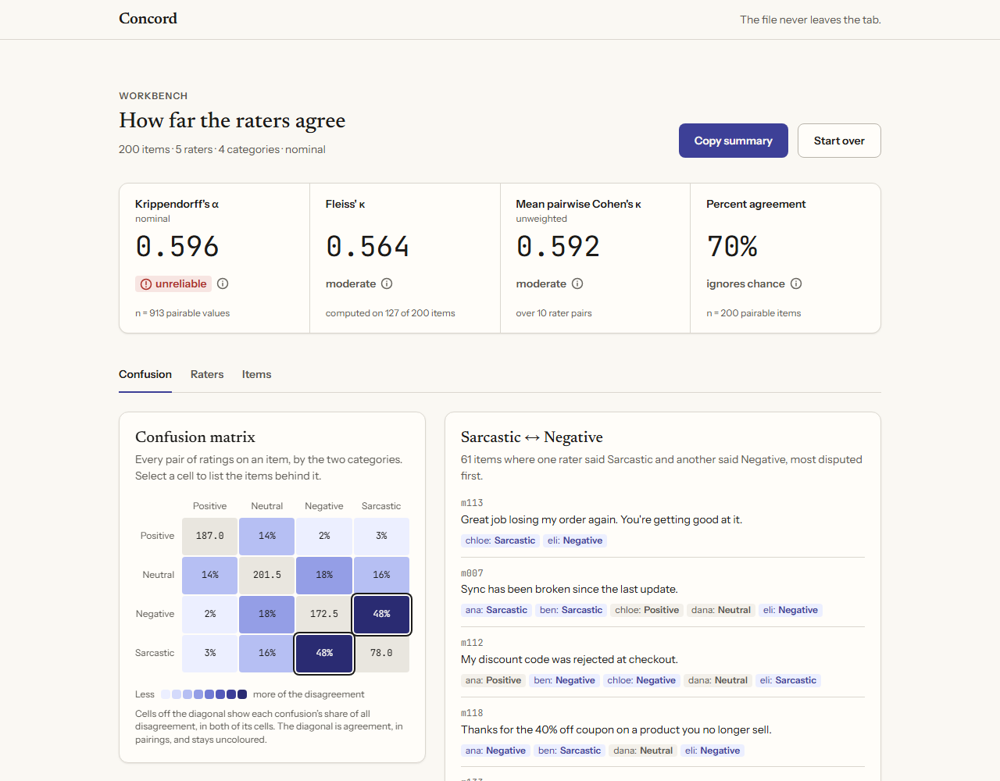

# Concord

**See where your raters disagree, and which categories they can't tell apart.**

Concord is an inter-annotator agreement workbench that runs entirely in the browser. Drop in a
CSV of labels from several raters and it tells you how much they agree, where they disagree,
and which pairs of labels your annotation guidelines fail to separate.

**Live:** [concord-plum.vercel.app](https://concord-plum.vercel.app)



## The file never leaves the tab

There is no backend, no account and no API key. The CSV is parsed and measured in your
browser, and nothing is uploaded. The fonts are self-hosted, so the page makes no third-party
request either.

## Try the demo

"Try the demo" on the landing page loads about 200 synthetic customer-support messages,
labelled Positive, Neutral, Negative or Sarcastic by five invented raters, and skips straight
to the workbench. The data is written to tell a story. Krippendorff's α is 0.596
(unreliable). Sarcastic ↔ Negative is the largest confusion by a clear margin, with 48% of
all disagreement. And one rater who falls back on Neutral when unsure is flagged: leaving
them out would raise α to 0.686.

## What it does

- **Your own file.** One CSV with a header row, in either shape: long (`item, rater, label`,
  one rating per row) or wide (an item column, then one column per rater). Concord guesses
  the shape and the columns, then shows a mapping screen where you confirm or change every
  choice, pick nominal or ordinal, and order ordinal categories. Problems such as duplicate
  ratings or too few raters are named, with their file lines where they have them, and block
  analysis until fixed.
- **Metric strip.** Krippendorff's α with its reliability band, Fleiss' κ, mean pairwise
  Cohen's κ and percent agreement. Each shows the n it was computed on, and says why when it
  can't be computed.
- **Confusion matrix.** Krippendorff's coincidence matrix as a heatmap, coloured by each
  confusion's share of all disagreement. It opens on the largest confusion. Click any cell
  to list the items behind it, with every rater's label.
- **Raters.** Mean κ per rater, and α with each rater left out, which flags a rater whose
  removal would raise α by 0.05 or more. Beside it, κ for every rater pair as a heatmap
  (a sortable list above 30 raters), unweighted, linear or quadratic.
- **Items.** Every item ranked by how much its raters disagree, with a bar showing what they
  said.
- **Copy summary.** The headline metrics, top confusions and flagged raters as Markdown, for
  a ticket or a guideline review.

## The metrics and their sources

| Metric | Source | How Concord applies it |
| --- | --- | --- |
| Krippendorff's α, nominal and ordinal | Krippendorff, K. (2011). *Computing Krippendorff's Alpha-Reliability*. Annenberg School for Communication. | Uses every item with two or more labels, so missing data is fine. |
| Cohen's κ, unweighted, linear and quadratic | Cohen, J. (1960). A coefficient of agreement for nominal scales. *Educational and Psychological Measurement*, 20(1), 37–46. Cohen, J. (1968). Weighted kappa. *Psychological Bulletin*, 70(4), 213–220. | Per rater pair, on the items both labelled. A pair sharing fewer than 10 items, or using only one category, is left out of the mean. |
| Fleiss' κ | Fleiss, J. L. (1971). Measuring nominal scale agreement among many raters. *Psychological Bulletin*, 76(5), 378–382. | Only items every rater labelled. With fewer than 10, it defers to α. |
| Percent agreement | Its definition: the share of agreeing rater pairs per item, averaged over items. | Ignores chance, and says so. |

The bands are conventions, and each band's tooltip in the app says so:

- **α:** reliable at 0.800 and above, tentative from 0.667, unreliable below. From
  Krippendorff, K. (2004). *Content Analysis: An Introduction to Its Methodology* (2nd ed.).
  Sage.
- **κ:** poor, slight, fair, moderate, substantial and almost perfect. From Landis, J. R.,
  & Koch, G. G. (1977). The measurement of observer agreement for categorical data.
  *Biometrics*, 33(1), 159–174.

### How the math is checked

The metrics are pure TypeScript functions, tested against published worked examples:

- Krippendorff's 2011 example C, nominal and ordinal;
- the Wikipedia examples for Cohen's κ and Fleiss' κ;
- a weighted-κ cross-check against scikit-learn.

Property tests cover perfect agreement, swapped raters, permuted items and constant data.
For the demo data, `scripts/golden.py` computes every headline metric with scikit-learn,
statsmodels and the `krippendorff` package. A test holds the app to those values within
1e-6.

## Running it locally

```sh
npm install
npm run dev        # http://localhost:5173
npm test           # Vitest
npm run typecheck
npm run build
```

It's built with React 18, TypeScript, Vite and Tailwind 4, and parses with Papa Parse. There
is no chart library: the heatmaps and bars are hand-rolled. `SPEC.md` is the full
specification, `CONTEXT.md` the vocabulary, and `docs/adr/` the decisions.

## Deferred to v1.1

Each is a decision, not an oversight.

- LLM guideline clarification (bring-your-own key, plus a no-key "Copy prompt" fallback).
  The confusion drill-down's selection (a label pair plus its items) is the payload it
  will consume; keep that selection a plain, serialisable value.
- Bootstrap confidence intervals for α (would need a Web Worker)
- Interval and ratio levels of measurement
- Gwet's AC1/AC2, Scott's π, Light's κ
- Row-normalised confusion toggle
- Excel and TSV input
- Files without a header row
- Multi-label items
- Share links, saved sessions, CSV export of tables
- Dark mode
- Mobile-first layouts
